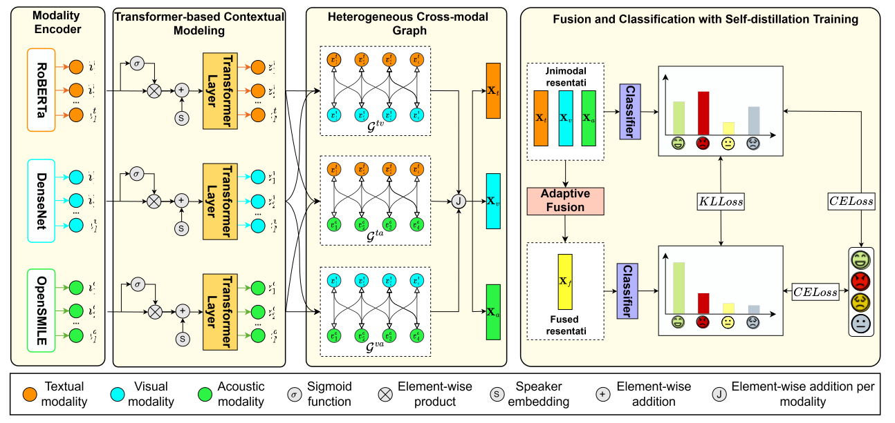

# Towards effective multimodal emotion recognition in conversations via joint multi-graph learning and self-distillation

<i>
  Official code repository for the manuscript 
  <b>"Towards effective multimodal emotion recognition in conversations via joint multi-graph learning and self-distillation"</b>, 
  accepted for publication in
  <a href="https://www.sciencedirect.com/journal/information-sciences">Information Sciences</a>.
</i>

## Abstract
> Emotion Recognition in Conversation (ERC) is a crucial component of empathetic dialogue systems, enabling conversational agents to comprehend users' expressed emotions and respond appropriately. In recent years, ERC has increasingly evolved toward multimodal approaches, particularly graph-based ones, that leverage complementary signals to enhance effectiveness. Although these approaches show promise, they face challenges in effectively modeling relational structures, computing the contribution of each modality during fusion, and regularizing unimodal representations to prevent modality bias. In this study, we propose DiGemo, a novel multimodal ERC framework that employs Transformer-based contextual modeling and graph-based learning to jointly capture both sequential dependencies within conversations and complex inter-utterance relational structures across modalities. To effectively balance and exploit multimodal information, we employ an adaptive fusion approach based on the Gated Multimodal Unit to estimate the contributions of each modality. In addition, we integrate a self-distillation training strategy to regularize unimodal representations, allowing each modality to learn from the fused multimodal representation and achieve more stable learning. DiGemo achieves Weighted F1-scores of 74.44% and 65.92% on the IEMOCAP and MELD datasets, respectively. These results validate the effectiveness of jointly modeling conversational context, cross-modal interactions, the adaptive contributions of modalities, and self-distillation for multimodal ERC.
>
> Index Terms: Gated multimodal unit, Graph learning, Self-distillation, Emotion recognition in conversation.

## Overall architecture

<p align="center">
  
</p>

## Install

### Clone this repository
```bash
git clone https://github.com/xchilryhkang/DiGemo.git
cd DiGemo
```

### Create Conda environment
```bash
conda create --name digemo python=3.9
conda activate digemo
```

### Install dependencies
```bash
pip install -r requirements.txt
```

Our experiments were run with **PyTorch 2.0.0**, **CUDA 11.7** on a single **NVIDIA GeForce RTX 3090 (24 GB)**.


## Project structure
```
DiGemo/
├── run.py            # Entry point: argument parsing, DDP setup, training loop over seeds
├── model.py          # DiGemo model
├── module.py         # Transformer contextual module, cross-modal graph, gated fusion
├── trainer.py        # Training / evaluation step and loss computation
├── dataloader.py     # IEMOCAP and MELD dataset classes
├── utils.py          # Utilities (e.g., automatic weighted loss)
├── plot.py           # t-SNE and confusion matrix visualization
├── complexity.py     # Parameter count and GFLOPs analysis
└── requirements.txt
```

## Usage

### Datasets

We evaluate DiGemo on two benchmark datasets for multimodal ERC:

- [**IEMOCAP**](https://sail.usc.edu/iemocap/) (Interactive Emotional Dyadic Motion Capture): dyadic conversations labeled with *Happy, Sad, Neutral, Angry, Excited, Frustrated*. Access requires signing a license agreement.
- [**MELD**](https://affective-meld.github.io/) (Multimodal EmotionLines Dataset): multi-party conversations from the *Friends* TV series labeled with *Neutral, Surprise, Fear, Sadness, Joy, Disgust, Anger*.

Following prior work, we use pre-extracted multimodal features. Download them here:
👉 [**Preprocessed features (Google Drive)**](https://drive.google.com/drive/folders/1qrlada7_F-YXgIvI5SmqEVBVxnJGNf3P?usp=drive_link)

Place the files as follows (or edit `IEMOCAP_path` and `MELD_path` in `run.py`):
```
DiGemo/
└── features/
    ├── iemocap_multi_features.pkl
    └── meld_multi_features.pkl
```

### Training and evaluation

**IEMOCAP**
```bash
python -u run.py --gpu 0 --port 1530 --dataset IEMOCAP --epochs 200 --loss_type distil \
--lr 2e-5 --batch_size 16 --hidden_dim 512 --win 17 17 --heter_n_layers 5 5 5 \
--dropout_1 0.05 --dropout_2 0.2 --gammas 1.0 0.4 1.0 --num_heads 16 --temp 3.0
```

**MELD**
```bash
python -u run.py --gpu 0 --port 1530 --dataset MELD --epochs 50 --loss_type distil \
--lr 5e-6 --batch_size 16 --hidden_dim 512 --win 4 4 --heter_n_layers 2 2 2 \
--dropout_1 0.2 --dropout_2 0.3 --gammas 1.0 0.2 1.0 --num_heads 32 --temp 10.0 --l2 1e-5
```

**Outputs**
- Best checkpoints: `checkpoints/best_model_{dataset}_{seed}.pth`
- Per-seed results: `results/log_results.txt`
- Classification report and t-SNE plots are produced at the end of each seed.

## Results

Results are averaged over 10 runs with different seeds.

| Dataset | ACC (%) | WF1 (%) |
|---------|:---:|:---:|
| IEMOCAP (6-class) | 74.52 ± 0.46 | 74.44 ± 0.46 |
| MELD (7-class) | 67.41 ± 0.30 | 65.92 ± 0.29 |

## Acknowledgements
This research is funded by FPT University under grant number DHFPT2026-12.

We thank the authors of [GraphSmile](https://github.com/lijfrank/GraphSmile) for releasing their code and preprocessed features.

<!-- ## Citation
If you use this code or part of it, please cite the following paper:
```bibtex
@article{TRANG2026124138,
  title   = {Towards effective multimodal emotion recognition in conversations via joint multi-graph learning and self-distillation},
  journal = {Information Sciences},
  pages   = {124138},
  year    = {2026},
  issn    = {0020-0255},
  doi     = {https://doi.org/10.1016/j.ins.2026.124138},
  author  = {Hoang Khang Trang and Bao Quoc Nguyen and Viet Vinh Khanh Dinh and Nhut Minh Nguyen and Nhat Truong Pham and Phuong-Nam Tran and Phuong Luu Vo and Duc Ngoc Minh Dang},
  keywords = {Gated multimodal unit, Graph learning, Self-distillation, Emotion recognition in conversation}
}
``` -->

